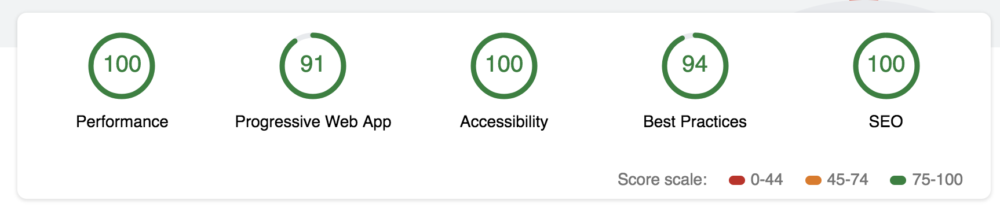
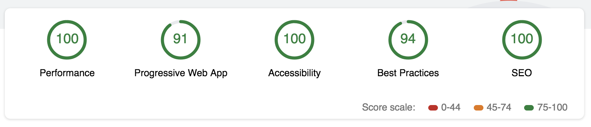

# Mobile Web Specialist Certification Course


---
#### _Three Stage Course Material Project - Restaurant Reviews_

## Project Overview: Stage 3

For the **Restaurant Reviews** projects, you will incrementally convert a static webpage to a mobile-ready web application. In **Stage Three**, you will take the connected application you yu built in Stage One and Stage Two and add additional functionality. You will add a form to allow users to create their own reviews. If the app is offline, your form will defer updating to the remote database until a connection is established. Finally, you’ll work to optimize your site to meet even stricter performance benchmarks than the previous project, and test again using Lighthouse.

### Specification

You will be provided code for an updated Node development server and a README for getting the server up and running locally on your computer. The README will also contain the API you will need to make JSON requests to the server. Once you have the server up, you will begin the work of improving your Stage Two project code.

This server is different than the server from stage 2, and has added capabilities. Make sure you are using the Stage Three server as you develop your project. Connecting to this server is the same as with Stage Two, however.

You can find the documentation for the new server in the README file for the server.

Now that you’ve connected your application to an external database, it’s time to begin adding new features to your app.

### Requirements

**Add a form to allow users to create their own reviews** In previous versions of the application, users could only read reviews from the database. You will need to add a form that adds new reviews to the database. The form should include the user’s name, the restaurant id, the user’s rating, and whatever comments they have. Submitting the form should update the server when the user is online.

**Add functionality to defer updates until the user is connected**: If the user is not online, the app should notify the user that they are not connected, and save the users' data to submit automatically when re-connected. In this case, the review should be deferred and sent to the server when connection is re-established (but the review should still be visible locally even before it gets to the server.)

**Meet the new performance requirements**: In addition to adding new features, the performance targets you met in Stage Two have tightened. Using Lighthouse, you’ll need to measure your site performance against the new targets.

+ **Progressive Web App** `score` should be at **90** or better.
+ **Performance** `score` should be at **90** or better.
+ **Accessibility** `score` should be at **90** or better.

### Note about ES6

Most of the code in this project has been written to the ES6 JavaScript specification for compatibility with modern web browsers and future proofing JavaScript code. As much as possible, try to maintain use of ES6 in any additional JavaScript you write. 


---

# Author: Anthony Nahas

Stage 3 consists of two parts!

- server side (NodeJS)
- client side (html, css, js) - hosted with NodeJS and express

## Check Env Requirements
#### _ensure please that these requirements are properly installed on your machine_
- NodeJS 
```bash 
$ npm node -v
```
- NPM
```bash 
$ npm npm -v
```

## Server Side

### (1) Clone the server repository
```bash 
$ git clone https://github.com/AnthonyNahas/mws-restaurant-stage-3.git
```

### (2) Install dependencies
```bash 
$ npm i
```

### (3) Install Sails.js globally
```bash 
$ npm i -g sails
```

### (4) Run the api server locally
```bash 
$ node server
```

---

## Client Side (this repository)

### Install dependencies
```bash 
$ npm i
```

### Run the PWA by build the app and then hosting it with NodeJS and express
```bash 
$ npm start
```

the app will be hosted on port `3000` -> `localhost:3000`

---

### Optional and additional tasks

#### Build Responsive Images (optional)
```bash 
$ grunt
```

### Build the app for production
```bash 
$ gulp build:prod
```


#### Lighthouse Result Overview - index.html


[see the full result](lighthouse/stage_3/stage_3_index.html)

#### Lighthouse Result Overview - restaurant.html


[see the full result](lighthouse/stage_3/stage_3_restaurant.html)


# Author

[Anthony Nahas](https://github.com/AnthonyNahas)
