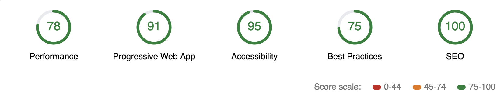
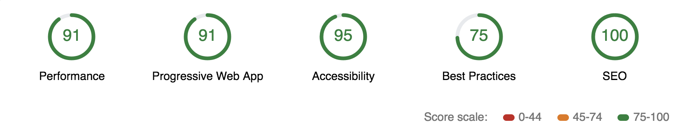

# Mobile Web Specialist Certification Course


---
#### _Three Stage Course Material Project - Restaurant Reviews_

## Project Overview: Stage 2

For the **Restaurant Reviews** projects, you will incrementally convert a static webpage to a mobile-ready web application. In **Stage One**, you will take a static design that lacks accessibility and convert the design to be responsive on different sized displays and accessible for screen reader use. You will also add a service worker to begin the process of creating a seamless offline experience for your users.

### Specification


You will be provided code for a Node development server and a README for getting the server up and running locally on your computer. The README will also contain the API you will need to make JSON requests to the server. Once you have the server up, you will begin the work of improving your Stage One project code.

The core functionality of the application will not change for this stage. Only the source of the data will change. You will use the fetch() API to make requests to the server to populate the content of your Restaurant Reviews app

### Requirements

**Use server data instead of local memory** In the first version of the application, all of the data for the restaurants was stored in the local application. You will need to change this behavior so that you are pulling all of your data from the server instead, and using the response data to generate the restaurant information on the main page and the detail page.

**Use IndexedDB to cache JSON responses** In order to maintain offline use with the development server you will need to update the service worker to store the JSON received by your requests using the IndexedDB API. As with Stage One, any page that has been visited by the user should be available offline, with data pulled from the shell database.

**Meet the minimum performance requirements** Once you have your app working with the server and working in offline mode, you’ll need to measure your site performance using Lighthouse.


Lighthouse measures performance in four areas, but your review will focus on three:

+ Progressive Web App score should be at 90 or better.
+ Performance score should be at 70 or better.
+ Accessibility score should be at 90 or better.
You can audit your site's performance with Lighthouse by using the Audit tab of Chrome Dev Tools.

### Note about ES6

Most of the code in this project has been written to the ES6 JavaScript specification for compatibility with modern web browsers and future proofing JavaScript code. As much as possible, try to maintain use of ES6 in any additional JavaScript you write. 


---

# Author: Anthony Nahas

Stage 2 consists of two parts!

- server side (NodeJS)
- client side (html, css, js) - hosted with NodeJS and express

## Check Env Requirements
#### _ensure please that these requirements are properly installed on your machine_
- NodeJS 
```bash 
$ npm node -v
```
- NPM
```bash 
$ npm npm -v
```

## Server Side

### (1) Clone the server repository
```bash 
$ git clone https://github.com/AnthonyNahas/mws-restaurant-stage-2.git
```

### (2) Install dependencies
```bash 
$ npm i
```

### (3) Install Sails.js globally
```bash 
$ npm i -g sails
```

### (4) Run the api server locally
```bash 
$ node server
```

---

## Client Side (this repository)

### Install dependencies
```bash 
$ npm i
```

### Run the PWA by build the app and then hosting it with NodeJS and express
```bash 
$ npm start
```

the app will be hosted on port `3000` -> `localhost:3000`

---

### Optional and additional tasks

#### Build Responsive Images (optional)
```bash 
$ grunt
```

### Build the app for production
```bash 
$ gulp build:prod
```


#### Lighthouse Result Overview - index.html


[see the full result](lighthouse/stage2_index_.html)

#### Lighthouse Result Overview - restaurant.html


[see the full result](lighthouse/stage2_restaurant_.html)


# Author

[Anthony Nahas](https://github.com/AnthonyNahas)
